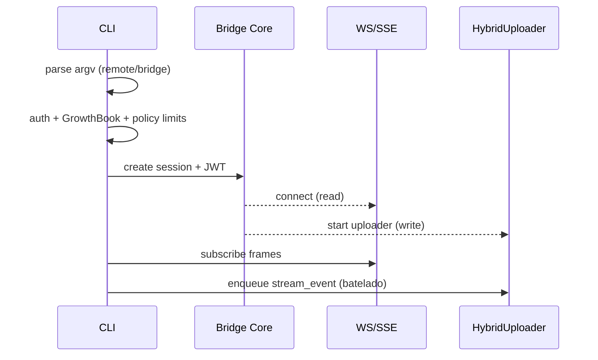

# Fase 1.5 — Bridge, Remote & CCR — Dissecacao

Objetivo: consolidar autenticação, gates (GrowthBook/policy), compat, reconexão e limites operacionais do Bridge/Remote/CCR, conectando Entry/CLI, StructuredIO e Transports.

Componentes
- Entry/CLI: aliases `remote-control|rc|remote|sync|bridge`; reescrita de argv; checagens de auth antes de GrowthBook; `waitForPolicyLimitsToLoad()`.
- Bridge Core: handshake, JWT/session tokens, compat de versão mínima, trusted device; `bridge/*` (api, messaging, status, permission callbacks).
- Transports: `WebSocketTransport` (leitura) + `HybridTransport` (escrita batelada); `SerialBatchEventUploader` com backoff+Jitter.
- StructuredIO: fila `outbound` garante ordenação; `control_request/response` para can_use_tool e MCP (JSON-RPC encapsulado).

Fluxo (Mermaid)

Compat e Estados
- Versão mínima: rejeitar quando server < min; mensagem clara e ação (upgrade).
- Estados do transport: `idle|connected|reconnecting|closing|closed`; pings/keep-alive.
- Replays: buffer circular de frames para reentrega após reconexão.

Limites Operacionais
- Batching: janela ~100ms, `maxBatchSize`, `maxQueueSize`; flush obrigatório antes de mensagens não-stream para preservar ordem.
- Backoff: exponencial com jitter e limites de tentativas; telemetria para drops.
- Timeouts: health-check de inatividade; diferenciar idle de falha.

Permissões Remotas
- can_use_tool via `control_request` com `request_id` estável; StructuredIO cancela perdedor (hook vs host) e deduplica.
- Bridge Permission Callbacks: padronizar payloads para UX consistente no host.

Segurança & Mitigações
- Autorização: exigir OAuth e tokens de sessão; não reutilizar tokens entre hosts.
- Policy: gates corporativos (allow_remote_control) obrigatórios; negar quando indeterminados.
- PII: reduzir payload; logs sem PII; mascarar paths sensíveis.
- Sandboxing: respeitar política do host (sem elevar privilégios via ponte).

Métricas mínimas
- Conexões: tentativas, duração, motivo de fechamento.
- Batching: tamanhos, retries, descartes.
- Permissões: prompts emitidos, decisões, latência.

Checklist
- [ ] Checar auth antes de GrowthBook (evita gate stale)
- [ ] Validar min-version e exibir ação
- [ ] Habilitar buffer de replay e pings
- [ ] Batching com flush em não-stream
- [ ] Telemetria para drops e retries
- [ ] Gates/policy obrigatórios e PII-minimization

