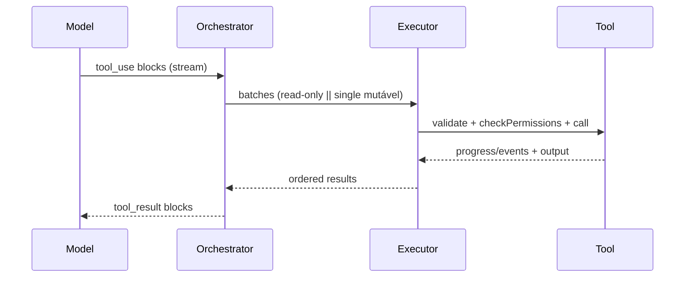
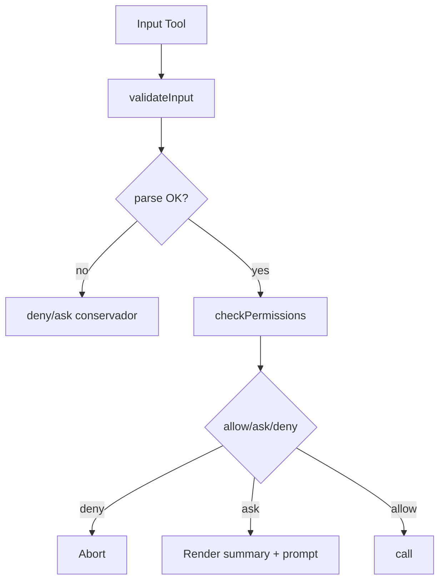

# Blueprint — Replicar o Agentfriend em Outros Projetos

Objetivo
- Transformar a dissecação em um guia de implementação portável, para que uma LLM consiga criar agentes com o mesmo nível de engenharia (segurança, UX e performance) do Agentfriend.

Arquitetura Essencial
- Tool API: `Tool<Input, Output, Progress>`
  - Input/Output com schemas (`zod`), `validateInput`, `checkPermissions`, `call`, `mapToolResultToToolResultBlockParam`, `render*`, `isConcurrencySafe`, `toAutoClassifierInput`.
  - Convergência de UX: `getActivityDescription`, `userFacingName`, mensagens de progresso e resultado.
- Executor em Streaming
  - `StreamingToolExecutor`: recebe tool_use blocks em tempo real, executa tools read‑only em paralelo e mutáveis em série; ordena saídas; drena `getRemainingResults()` em abort/turn end; `discard()` em fallback.
  - Particionamento: `partitionToolCalls` forma lotes seguros; `getMaxToolUseConcurrency()` limita paralelismo.
- Pipeline de Permissões
  - Regras por tool (deny/ask/allow), match exato/prefix/wildcard com normalização (bash/PowerShell case sensitivity, aliases);
  - `getActivityDescription` para prompts “ask”; `PermissionResult` com `updatedInput` para reescritas seguras.
  - FileSystem: `checkReadPermissionForTool`, ignore patterns, resolução segura de paths, `.git` e zonas protegidas.
- Segurança e Shells
  - Bash/PowerShell: sandbox, validação de paths, análise de comandos (read‑only, perigosos, redireções), tratamento de UNC, download cradles/IEX/encoded payloads; abortabilidade e backgrounding.
  - Invariantes: preferir “deny on parse failure”, bloquear providers não‑FS (PowerShell), normalização de whitespace e nomes canônicos.
- Memória/Compactação
  - micro/auto‑compact, prompts dedicados, post‑compact reidrata anexos/diffs; budgets de tokens; anexos persistidos para outputs grandes.
- LSP/Busca FS
  - LSPTool para navegação; Grep/Glob para busca; resultados paginados e relativizados; caps por linhas/bytes.
- MCP (Opcional)
  - ConnectionManager; `MCPTool`, `ReadMcpResourceTool`, `ListMcpResourcesTool`; pseudo‑tool de OAuth (McpAuthTool); escopos e channel permissions.

Invariantes de Segurança (Cheat‑sheet)
- Paths: resolver com FS seguro, negar `..`/symlinks perigosos/UNC quando aplicável; negar providers não‑FS em PowerShell; proteger `.git` (hooks/refs/objects/HEAD).
- Shell: classificar read‑only de forma conservadora; bloquear comandos dinâmicos (IEX/Add‑Type/COM), downloads suspeitos e encoded payloads.
- Permissões: preferir `ask/deny` quando parse falha ou quando flags/args não inspecionáveis surgirem; nunca “fail‑open”.
- Sandbox: respeitar política corporativa; nunca ignorar sandbox obrigatório por plataforma (Windows nativo → recusar).

Bridge/Remote/CCR (Portabilidade)
- Handshake com tokens curtos e revogáveis; validar versão mínima e política corporativa.
- Transports híbridos: leitura WS/SSE + escrita em lotes com flush antes de não‑stream.
- Replays pós‑reconexão; backoff com jitter; métricas de drops/retries.
- PII‑minimization em payloads; logs sem paths/conteúdo sensível.

Telemetria & Perf
- Eventos mínimos: startup/model/tool/permission/transport; amostragem produtiva; metas de TTI e latências.
- Prefetches só após primeira pintura; checkpoints para regressão.

Ambiente & Segredos
- Prefetch não‑bloqueante; fallback por SO; trust dialog antes de leituras sensíveis.
- Killswitch e “fail‑closed” para políticas indeterminadas.

Plano de Adoção em Novo Projeto
1) Foundation
   - Definir `Tool` interface e utilitários (schemas, render, storage de resultados grandes, progress plumbing).
   - Implementar executor em streaming e particionamento por batches.
2) Segurança/Permissões
   - Portar pipeline de permissões (rules + matching + filesystem policies).
   - Adotar validações de shell (bash/PS) e path; integrar sandbox.
3) Ferramentas Núcleo (read‑only primeiro)
   - `GlobTool`, `GrepTool`, `FileReadTool`, `LSPTool`.
4) Mutáveis
   - `FileEditTool` (diff seguro); `BashTool`/`PowerShellTool` com background e abort; `SkillTool`/`AgentTool`.
5) Memória/Compactação
   - micro/auto‑compact + prompts; persistência de anexos.
6) MCP (se necessário)
   - ConnectionManager e tools; autenticação.

Sequência de Execução (Mermaid)

Permissões (Mermaid)

Testes e Qualidade
- Read‑only vs mutáveis: cenários de concorrência; abortabilidade (mata subprocessos irmãos); timeouts e truncation.
- Permissões: regras exatas/prefix/wildcard; negações de `.git` e paths perigosos; UNC/NTLM; providers PowerShell.
- Telemetria: start/end/failed; tamanhos/durações/concurrency/descoberta de skills.

Adaptação por Plataforma
- Windows nativo: sem sandbox POSIX; política pode bloquear shells. PowerShell com validações reforçadas e providers não‑FS bloqueados.
- WSL/macOS/Linux: sandbox habilitável; diferenças de performance de FS (WSL mais lento para leitura intensiva).

Riscos & Mitigações (execução)
- Windows nativo: sem sandbox POSIX → shells podem ser negados por política; preferir WSL.
- Supply chain (MCP/Plugins): whitelist, validação forte, isolamento de diretório e assinaturas quando disponíveis.
- Privacidade: opt‑out corporativo, PII‑minimization e retenção mínima.

Entrega Mínima Viável (ordem sugerida)
1) Tool API + executor streaming + Grep/Glob
2) FileRead + LSP + permissões FS
3) Bash minimal (read‑only) + PS minimal + sandbox flags
4) FileEdit diffs + memória/compactação
5) Skills/Agents + telemetria
6) MCP (quando aplicável)
