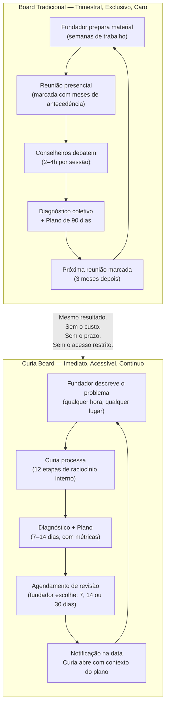

# O que é a Curia

## O que é a Curia

A Curia é um conselho estratégico virtual para fundadores de pequenas e médias empresas. Ela combina o raciocínio de um sócio de consultoria estratégica, a visão operacional de um COO experiente e o pensamento financeiro de um CFO — tudo disponível em uma conversa, a qualquer hora.

O nome vem da tradição dos grandes conselhos: a Curia era o senado de Roma, o espaço onde as decisões mais importantes eram tomadas. A ideia é essa — trazer esse nível de conselho para quem nunca teve acesso a ele.

---

## Proposta de Valor

Toda empresa de sucesso tem um conselho. Investidores experientes, mentores estratégicos, conselheiros com décadas de mercado. Eles fazem as perguntas difíceis, desafiam as decisões do fundador e ajudam a enxergar o que está invisível no dia a dia.

A Curia entrega isso de forma acessível: uma sessão estratégica profunda, com diagnóstico real, análise de riscos, frameworks aplicados e um plano concreto para as próximas duas semanas — sem precisar agendar, sem esperar, sem pagar por hora de consultoria.

---

## Problema que Resolve

Fundadores de PMEs tomam decisões críticas sozinhos. Sem experiência prévia para comparar, sem conselheiros para desafiar suas hipóteses, sem estrutura para separar o problema real do sintoma que está na superfície.

O resultado é previsível: decisões reativas, tempo gasto nos lugares errados, crescimento travado por problemas que poderiam ter sido diagnosticados meses antes.

Consultoria estratégica de qualidade custa caro e não é feita para PMEs. Mentores são raros e com disponibilidade limitada. Comunidades e fóruns dão opiniões, não diagnósticos.

A Curia resolve o gap entre "fundador sozinho" e "empresa com conselho real".

---

## Solução — O Produto

### Como um Board profissional funciona — e como a Curia o comprime

---

A Curia é um chat estratégico com IA. O fundador descreve o desafio do momento — pode ser um problema de vendas, uma decisão de contratação, uma crise de caixa, uma dúvida sobre posicionamento — e a Curia responde com uma análise estruturada:

- **Diagnóstico** — o que está acontecendo de verdade
- **Problema Central** — a causa raiz, não o sintoma
- **Riscos Estratégicos** — o que pode dar errado se não for endereçado
- **Leitura de Performance** — o que os números dizem
- **Framework Aplicado** — qual modelo mental melhor explica a situação
- **Recomendações Estratégicas** — 3 a 5 ações concretas (Como você vai metrificar o seu plano? Aqui é NÍVEL advisor Sênior)
- **Próximos Passos (7–14 dias)** — o que fazer essa semana e na próxima
- **Perguntas Difíceis** — as 3 perguntas que um bom conselheiro faria 
- Retorno para checagem do Plano -- Sempre sugere de marcar retorno para checagem do Plano. 

A Curia não responde como um assistente genérico. Ela raciocina antes de responder — diagnostica o estágio da empresa, lê o contexto, aplica os frameworks certos e só então formula a resposta.

---

## Modelo de Monetização

O modelo ainda está sendo validado, mas a lógica é freemium baseada em valor entregue:

- **Acesso livre** às conversas estratégicas com a Curia
- **Plano de ação detalhado** (7–14 dias) como gatilho de conversão para o plano pago

A métrica que orienta o negócio não é só aquisição — é entrega de valor. O produto está instrumentado para medir se o usuário chegou à clareza estratégica (diagnóstico + problema central identificados) e se pediu um plano de ação (intenção de agir). Esses dois eventos definem o que "a Curia funcionou" significa na prática.

O mercado prioritário é o Brasil, com produto em português e expansão prevista para demais mercados lusófonos e hispânicos.
